ICE System Quality Control Handbook
===================================

.. role:: bash(code)
   :language: bash

.. role:: python(code)
   :language: python

This handbook is intended as a companion book, providing dia-
grams for easier identification of the steps in the QC process. Please
follow the instructions as written on screen, and refer to these pages
as needed

Authors:
    JF Cliche, Antoine Parise

MGADC08 - CHIME Mezzanine
-------------------------

TODO

MGK7MB - ICE Motherboard
------------------------

.. figure:: ../../images/iceqc/IceBoardPhotos/main_view.jpg
    :width: 75%
    :alt: Motherboard
    :align: center

    Motherboard

Inspection Test
^^^^^^^^^^^^^^^
**Step 1:** Is the FPGA heatsink securely attached?
**Step 2:** Are the FPGA heatsink pins cut near the stiffener?

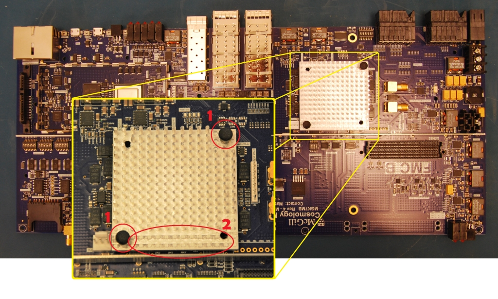

    Points of interest for Steps 1 and 2

**Step 3:** Is the board stiffener installed, and the board reasonably flat?
**Step 4:** Are the PLL heatsinks attached?
**Step 5:** Does the arm shield fence look straight?

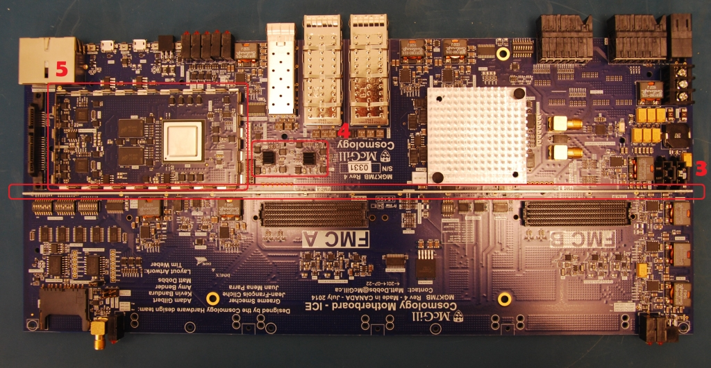

    Points of interest for Steps 3,4 and 5

**Step 6:** Are the dipswitches set correctly?
**Step 7:** Are the jumpers set correctly?

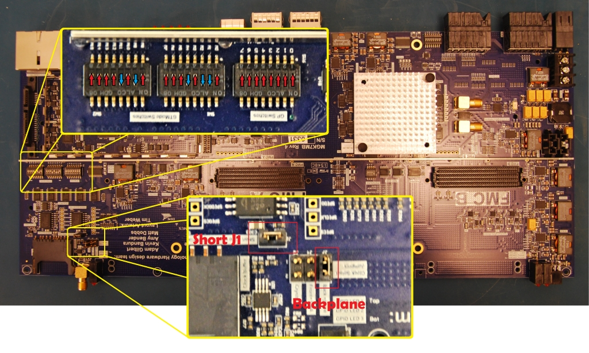

    Front of the ICE board

**Step 8:** Are the 90 pin Molex backplane connectors screwed down? (back-
side)
**Step 9:** Are the QSFP and SFP connectors soldered in place? (backside)
**Step 10:** Do all the buck converters have the additional hand-soldered ca-
pacitor? (backside)

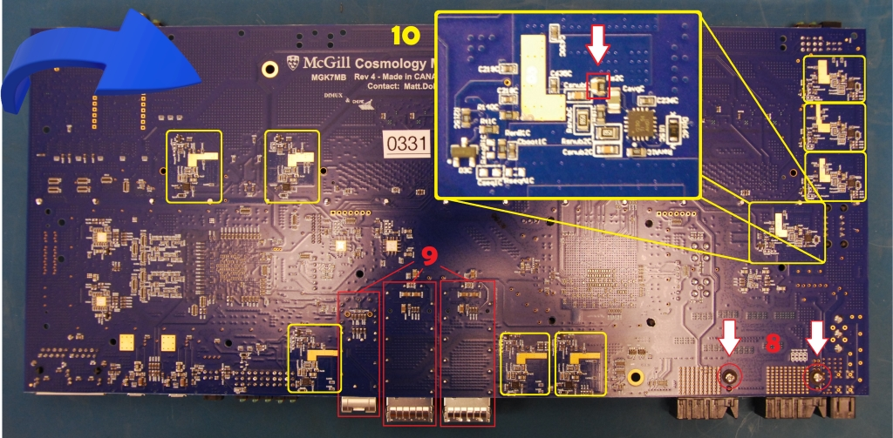

**Step 11:** Do all the FMC power switches look well soldered?
**Step 12:** Is the blue patch wire in place and secured?

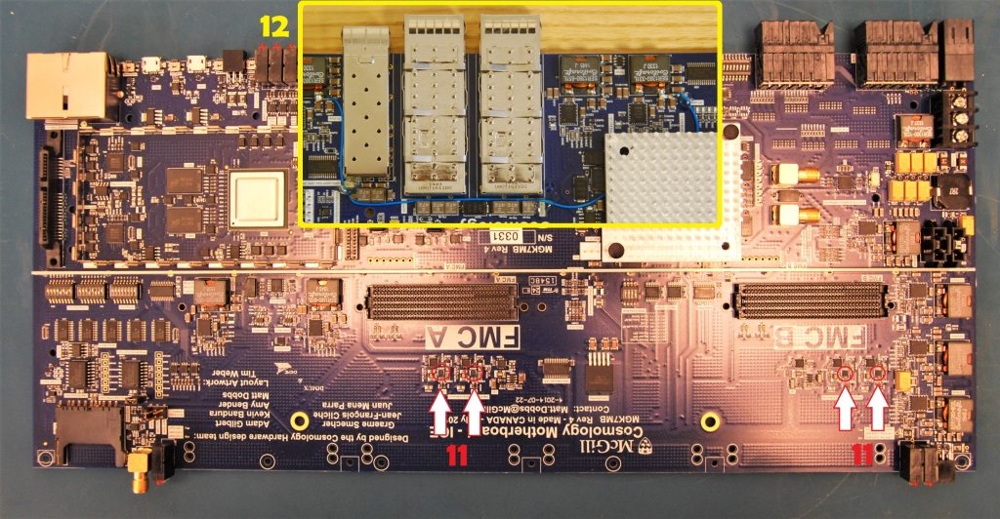

Impedance test
^^^^^^^^^^^^^^

Before taking measurements, make sure that the board setup is as shown in
figure 16.

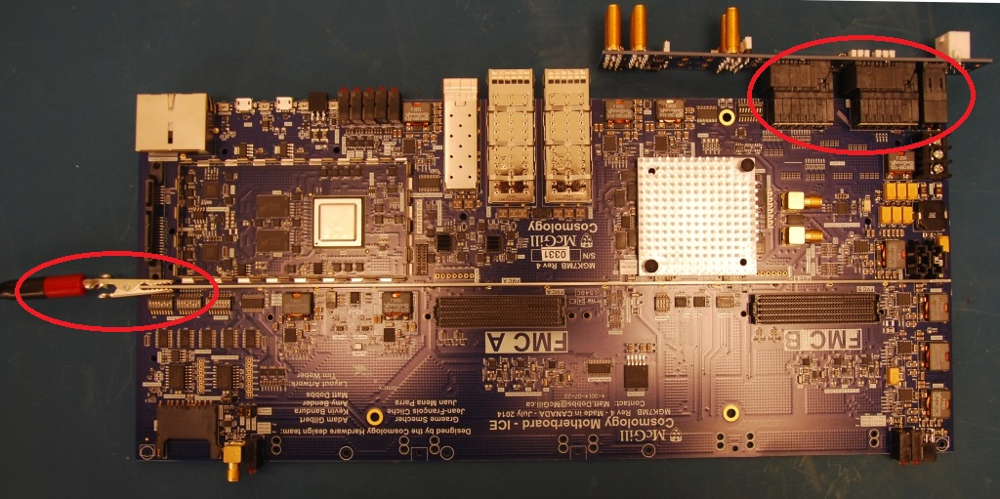

    Figure 16: Iceboard with ground connection and one-slot backplane

Apply the red test probe to the test points in the following order: +V
supply followed by the buck converters in a counter clockwise order - see
figure 17. Refer to probe location 10 in the diagram for instructions on
where to apply the test probe for all buck converters.

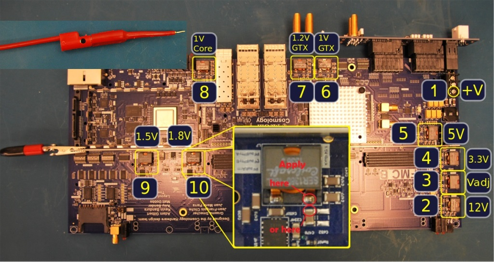

    Figure 17: Impedance measurement test locations

Power test
^^^^^^^^^^

Connect the power cable to the backplane as shown in figure 18.

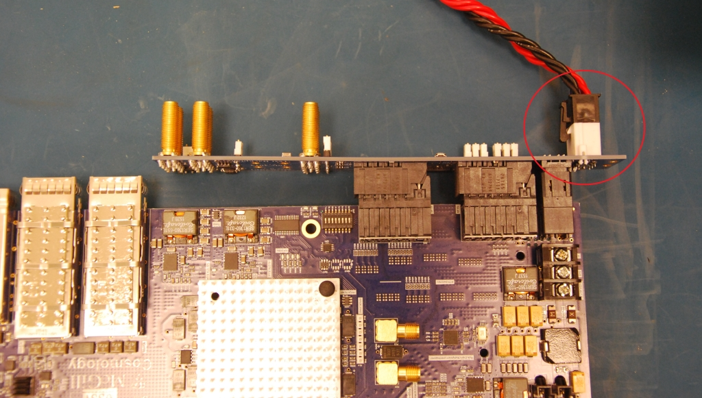

    Figure 18: Power cable attached to one-slot backplane with motherboard

Check that all 9 power LEDs are turned on as shown in figure 19.

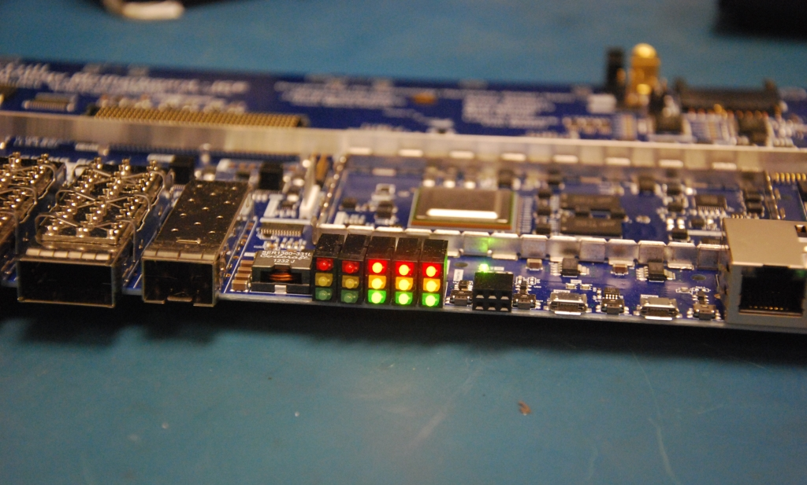

    Figure 19: Motherboards 9 power LEDS

PLL programming
^^^^^^^^^^^^^^^

Connect the PLL programming cable to the board, making sure that the
black marked side faces the SFP connectors - see figure 20.

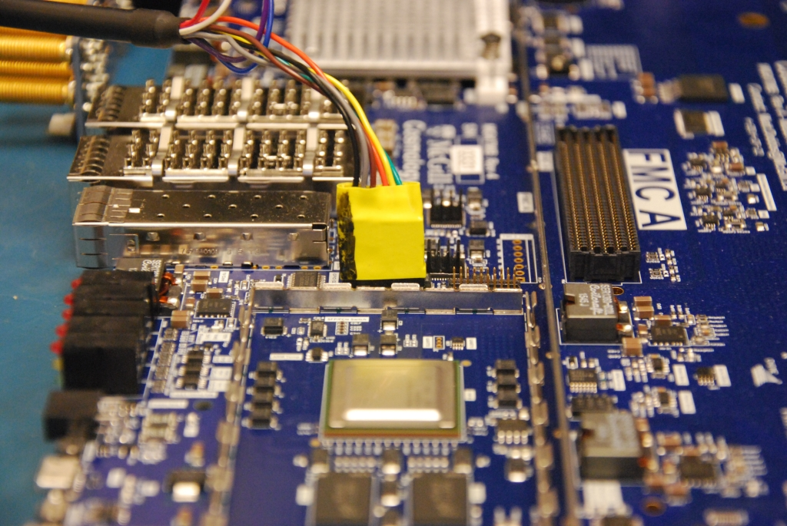

    Figure 20: PLL Programming dongle

Check that both PLL lock lights are turned on (green & yellow on the right) see figure 21

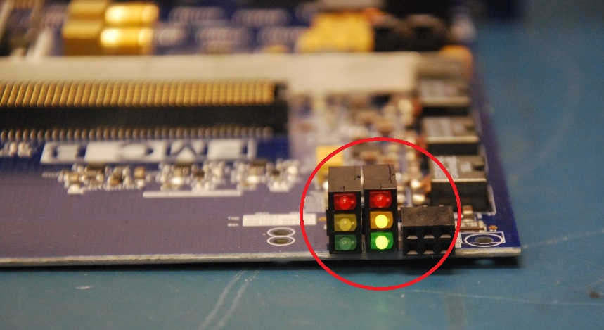

    Figure 21: PLL Lock LEDs

Memory test
^^^^^^^^^^^

